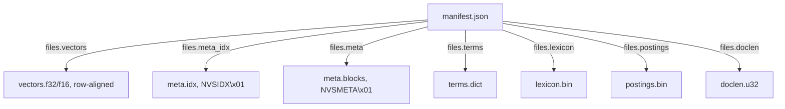

# nvs-core

Native Vector Store — Rust core library for read-only vector + lexical search over packed bundles.

[](https://crates.io/crates/nvs-core)
[](https://docs.rs/nvs-core)

Features

- Compact on-disk bundle format with manifest and checksums
- Memory-mapped readers for vectors, metadata blocks, and BM25 index
- Fast vector, BM25, and hybrid search via `nvs_core::VectorStore`
- Structured document reads: `id`, `text`, `metadata` (JSON)
- Binary invariants enforced at open time:
  - Endianness is little (`manifest.endianness = "little"`)
  - Vector rows are padded to `files.vectors.row_alignment` (default 64 bytes)
  - Magic headers: `meta.idx` starts with `NVSIDX\x01`, `meta.blocks` starts with `NVSMETA\x01`
  - `meta.idx` entry = `{ u32 block_id, u32 offset, u32 doc_size, u32 reserved0 }`
  - `meta.blocks` header entries = `{ u32 comp_size, u32 decomp_size, u32 doc_count, u32 codec }`

Install

Add to `Cargo.toml`:

```toml
[dependencies]
nvs-core = "0.1"
```

Quick start

```rust
use nvs_core::VectorStore;

// Open a bundle (directory containing manifest.json, vectors, meta.* etc.)
let store = VectorStore::open("/path/to/bundle") ?;

// Hybrid search
let embedding: Vec<f32> = vec![0.0, 1.0, 0.0];
let q = "keywords";
let hits = store.search_hybrid( & embedding, q, 5, 0.6);

// Fetch full documents for the top-k
let ids: Vec<u32> = hits.iter().map( | (id, _) | * id).collect();
let docs = store.get_documents( & ids);

// Prefer parsed JSON metadata directly
let (id, text, meta) = store.bundle().get_document_value(ids[0]).unwrap();
println!("id={} meta_keys={}", id, meta.as_object().map(|m| m.len()).unwrap_or(0));
```

More

- Bundle format: https://github.com/martinboros/native-vector-store/blob/main/documentation/MANIFEST_SPEC.md
- CLI packer (build bundles): https://crates.io/crates/nvs-packer
- Lambda example (serverless
  query): https://github.com/martinboros/native-vector-store/tree/main/src/crates/nvs-lambda-sample

Bundle overview



Binary files (what each contains)

vectors.f32 / vectors.f16

- Row-major matrix of document embeddings. Each row holds `dim` floats in the dtype declared by `embedding.dtype` (f32 or f16).
- Rows are padded to `files.vectors.row_alignment` bytes (typically 64) to enable aligned SIMD reads. This alignment is part of the manifest so readers can validate sizes and compute row strides deterministically.
- nvs-core maps this file and computes dot products directly over the mapped region; for f16, the reader widens to f32 in-register using platform SIMD where available.

meta.idx

- A dense index mapping logical document IDs (`0..num_docs-1`) to their location in `meta.blocks`.
- Layout: 8-byte magic header `NVSIDX\x01`, followed by `num_docs` entries of 16 bytes: `{ u32 block_id, u32 offset_in_block, u32 doc_size, u32 reserved0 }`.
- `reserved0` is zero today and reserved for future growth (e.g., flags or hi-bits for 64-bit offsets). Readers validate entry count and bounds before accessing meta records.

meta.blocks

- A fixed-block container for variable-length, length-prefixed document records. The file begins with 8-byte magic `NVSMETA\x01`, a `u32 block_count`, then `block_count` headers and `block_count` fixed-size payloads.
- Each header is 16 bytes: `{ u32 comp_size, u32 decomp_size, u32 doc_count, u32 codec }` where `codec` is 0 (none) or 1 (zstd). The payload for each block is exactly `files.meta.block_size` bytes; when compressed, only the first `comp_size` bytes are compressed data and the rest is padding.
- Records in a (decompressed) block are concatenated as `[u32 id_len][id][u32 text_len][text][u32 meta_len][metadata_json]`. `meta.idx` points into a specific block at the byte offset `offset_in_block` with `doc_size` bytes.

terms.dict

- A term dictionary stored as length-prefixed UTF‑8 strings in lexical order. For each term: `[u32 len][bytes…]`.
- The order of terms defines implicit term IDs (0..terms-1), used to align with `lexicon.bin` entries. The reader loads this to map a normalized token to its term ID.

lexicon.bin

- A fixed-size array parallel to `terms.dict` with one 16‑byte entry per term: `{ u64 offset, u32 length, u32 df }`.
- `offset` is the byte offset into `postings.bin` for this term’s postings; `length` is the number of postings (pairs) for the term; `df` is the document frequency.
- Together with `postings.bin`, this allows random access to a term’s inverted list without scanning.

postings.bin

- Concatenated postings lists for all terms. For each term (in `terms.dict` order), `length` pairs of `{ u32 delta_docid, u32 tf }` are written.
- `delta_docid` is the document ID delta relative to the previous posting (varint‑like compression by delta coding using fixed u32 here); `tf` is the term frequency within that document. The reader reconstructs absolute doc IDs via prefix sums.
- During scoring, readers iterate postings, look up `doclen`, compute BM25 with `avgdl`/`k1`/`b` from the manifest, and accumulate scores.

doclen.u32

- A dense array of `num_docs` `u32` values holding document lengths (token counts) after tokenization and filtering.
- Used in BM25 denominator to normalize term frequency by document length relative to average document length (`bm25.avgdl` in manifest).

License: MIT
