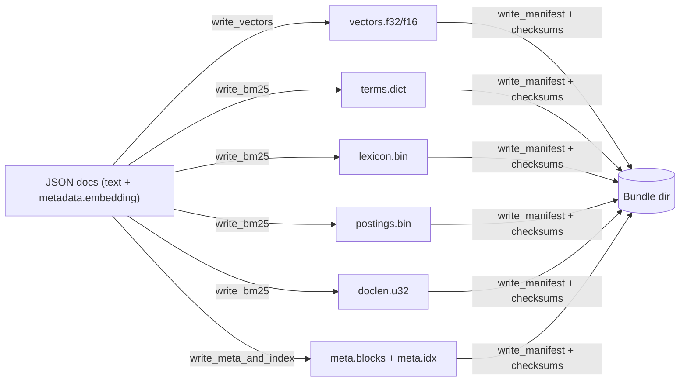

# nvs-packer

CLI and library to convert JSON documents with embeddings into a Native Vector Store bundle.

Input JSON format

- Array of objects. Each element must contain `text` (or `content`) and `metadata.embedding` (array of floats). Optional
  additional metadata fields are preserved.

Examples

```bash
cargo run -p nvs-packer -- \
  ./my-json --out ./.nvs-bundle \
  --quantize f16 --bm25-buckets 32 --compress zstd --model my-embedder
```

As a library, call the loader and writer modules directly for custom flows.

Outputs

- vectors.f32 or vectors.f16
- meta.blocks + meta.idx (both with magic headers)
- terms.dict, postings.bin, lexicon.bin, doclen.u32
- manifest.json (endianness, row_alignment), checksums.xxhash64, receipts.txt

Binary layout highlights

- `manifest.endianness = "little"`
- `files.vectors.row_alignment` (default 64) controls vector row stride
- Magic: `meta.idx` begins with `NVSIDX\x01`; `meta.blocks` begins with `NVSMETA\x01`



License: MIT
