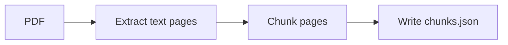

# nvs-pdf

PDF chunking orchestrator: extract pages (nvs-pdf-core or PDFium), chunk via the shared chunker, write chunks JSON.

API

- `parse_to_chunks(path, &PdfChunkOptions)` → `Vec<Chunk>`
- `parse_to_chunks_with_stats(path, &PdfChunkOptions)` → `(Vec<Chunk>, ChunkStats)`
- `write_chunks_json(path, chunks, out)` → chunks array with `mimetype:"application/pdf"`

Example

```rust
let path = std::path::Path::new("/path/file.pdf");
let chunks = nvs_pdf::parse_to_chunks(path, &nvs_pdf::PdfChunkOptions::default())?;
nvs_pdf::write_chunks_json(path, &chunks, std::path::Path::new("/tmp/chunks.json"))?;
```

Pipeline



License: MIT

